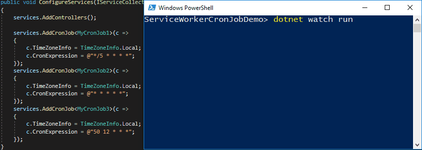

# Service Worker Cron Jobs Demo

You may want to ask, "_What's the difference between a hosted service and a background thread?_" The difference is that the hosted service will be started and stopped with the application. While, when starting a background thread, the thread cannot gracefully handle clean-up actions and will be killed when the application is stopped. The `HostedServiceExecutor` will handle the starting and stopping of a hosted service, which allows for graceful cleanup when the application is stopped.

Starts from version 2.1, .NET Core provides a native abstract base class `BackgroundService`, which includes common operations for background jobs such as `CancellationToken` and housekeeping works.

## [Medium Article: Schedule Cron Jobs using HostedService in ASP.NET Core](https://codeburst.io/schedule-cron-jobs-using-hostedservice-in-asp-net-core-e17c47ba06)

In this blog post, we will go over the use case of scheduling cron jobs using a customized `HostedService` in an ASP.NET Core Web API project. The following screen recording shows the runtime logging for the final application, which has three background tasks running at every 5 minutes, every 1 minute, and every day at 12:50 PM.

